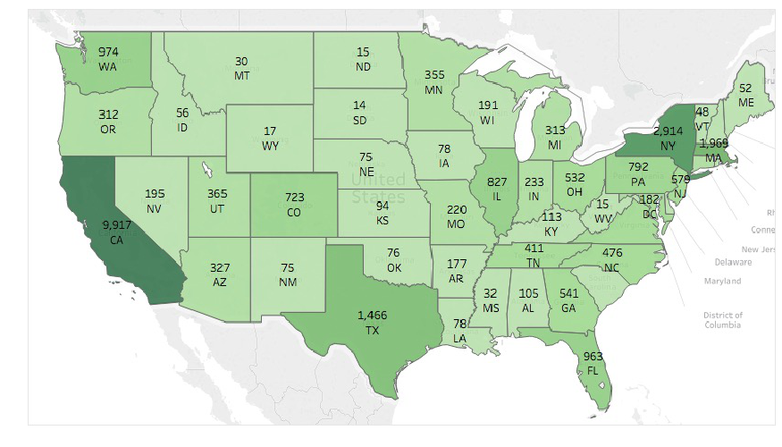
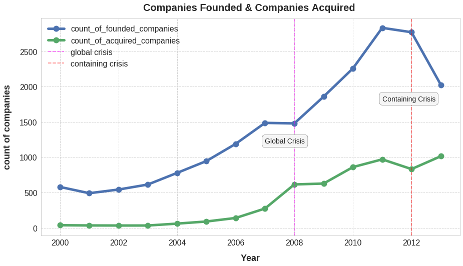
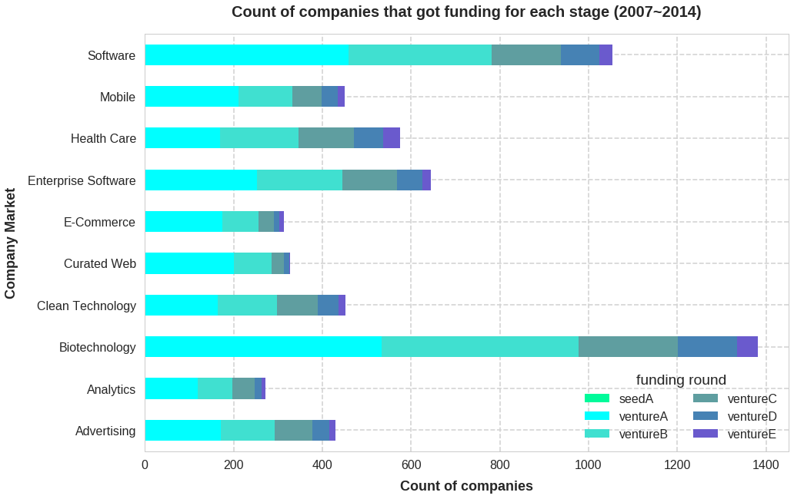

## US companies and industry landscape with Crunchbase  Data 
### Overview
In order to get a better understanding of companies and industry landscape in US,  we analyzed companies distributions, funding amounts, and aquisition trends in US using the Crunchbase data. 
The [jupyter notebook](https://github.com/YuexiSC/data-visualization/blob/master/crunchbase_data_analysis/crunch_base_data_analysis.ipynb) file consists of the following sections. The jupyter file is also available to view in [NBviewer](http://nbviewer.jupyter.org/github/YuexiSC/data-visualization/blob/master/crunchbase_data_analysis/crunch_base_data_analysis.ipynb):   
<li> Environment Configuration 
<li> Data Preparation 
<li> Data Visualization    
        
### Data 
This project used the following four datasets, which are available in  (**Datasource**: [Crunchbase data](https://data.crunchbase.com/docs) )   
And you can check the four sample datasets [**Here**](https://github.com/YuexiSC/data-visualization/tree/master/crunchbase_data_analysis/datasets).


|Table | Number of Entries |Contents |
|--|--|--|
| `company` |49,438  | <li>regional information <li>market/ industry information<li>funding status  |
|`investment` |114,506|<li>companies's information <li>investor's <li>funding information |
| `acquisition` |  55,240|<li>companies and its acquirer's  information <li>price_amount of money the acquirer paid|
|`rounds `|83,870|<li>companies' information <li>funding status <li>amount of money rasied|


### Tech Stacks
The project is written in Python 3.6 with Google Colaboratory tool. We used pandas and numpy for data analysis, and used seaborn, worldcloud and matplotlib for data visualization.
```
import pandas as pd
import numpy as np
import seaborn as sns
import matplotlib.pyplot as plt
% matplotlib inline
import warnings
from wordcloud import WordCloud
warnings.filterwarnings('ignore')
from IPython.display import Image
import matplotlib.image as mpimg
 ```

## Highlights 
The highlighted findings with plots from jupyter notebook are as follows: 
1. The number and distribution of US companies    
*The total number of companies in each state in US from 1960-2014*  
>1. This graph was generated using Tableau, showing a basic regional distribution of the companies in US. 
>2. California has the most number of companies, the number of which is way greater than the second state, New York.  

 

2. Counts of companies founded and got acquired from year (2000 to 2013)        
*The trend of total companies founded and acquired over years.*  
>1.  Entrepreneurship is on an upward trend.  
>2.  Whether the crises have impacts on Entrepreneurship trend:   
>> 1) we can see that from 2007 to 2008 total companies founded remain constant, but no expected sharp decrease. And after financial crisis in 2008, there was a spike of total companies founded, kind of an economic revival, but the acquisition activities kept constant after financial crisis.      
>> 2) However, after crisis of 2012, the Containing Crisis, the total companies founded had a sharp decrease. We can tell the Containing Crisis that countries and banks struggle to get balances sheets has much negative impact on starting a company. In the contrast, acquisition activities increased slightly.   

So, we can tell from this plot, that crisis do have some impacts on total companies founded and acquired each year, but the most famous 2008 financial crisis actually didn’t affect much on total companies founded and acquired.





3. Count of companies that got funding for each stage from 2007 to 2014    
*How the number of acquired companies in Top 5 market changes over time?*     
>1. This plot shows the funding funnels for each industry. Lighter shadings of color indicates earlier funding rounds and darker shading represent later rounds. The ratio of companies that received a later stage round to companies that received an earlier stage round could roughly represent the survival rate of the companies. This is more representative for earlier stages such as A to C and less significant for later stages due to higher possibility for companies to exit in round C or later.    
>2. From the graph, we can see that Mobile, E-Commerce and Curated Web have less ratio of companies advancing to later stages. This could mean that there’s higher competition in these industries due to lower barriers to entry. At the same time, it also shows that most companies in these industries have an earlier exit as they could prove their value earlier. Whereas for companies in Biotech, Health Care and Enterprise Software have almost an equal amount of companies in round A and B of funding stage, with higher ratio of later stage funding as well. It tells us that there is probably a higher barrier to entry to these industries, but once you get funded, it’s very likely for the company to survive for a longer period of time. At the same time, it also shows that they might take longer time to exit as the number of companies in later stages of funding is pretty high.        
>3. Therefore, if you want more job stability, Biotech, Enterprise Software and Health Care startups are good choices. Whereas if you do not mind higher risk that comes with higher reward, Mobile, E-Commerce and Curated Web companies might fit you better.  

   


